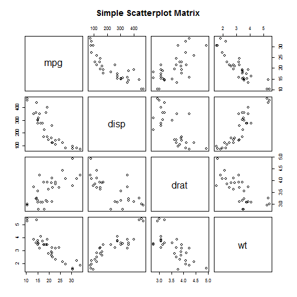

## Backgrond

This presentation is part of the project for Coursera Developing Data Products class. The peer assessed assignment has two parts. First, we need to create a Shiny application and deploy it on Rstudio's servers. Second, we should use Slidify or Rstudio Presenter to prepare a reproducible pitch presentation about the application. This presentation adresses the second part of the course project.

The app developed for the first part of the assignment is avalilable at:
https://milindvijay.shinyapps.io/DataProducts/
 
Source code for ui.R and server.R files are available on the GitHub:
https://github.com/milindvijay/DataProducts

---

## Select the best car for your trip App

This app helps you to choose a car for a trip, using the mtcars dataset from [R].

First, you need to inform the distance of your trip and the price of gasoline in your region. These information will be used to calculate the Gasoline Expenditure for each car in the dataset. Then, you can enter the maximum amount of money you want to spend on gasoline, and the table shows only the cars that have Miles per Gallon (mpg) that can go below this value.

Second, you can choose some caractheristcs of the cars that you desire: Cylinders, Displacement, Horse Power and Transmission. The table will show only the cars with the filters selected. You can sort the table according to the variable you want by clicking the arrows at the top of the table.

---

## mtcars dataset

The data used in the app comes from the Motor Trend Car Road Tests (mtcars) dataset. The data was extracted from the 1974 Motor Trend US magazine, and comprises fuel consumption and 10 aspects of automobile design and performance for 32 automobiles (1973-74 models). We can look to some carachteristics of the data:


```r
str(mtcars)
```

```
## 'data.frame':	32 obs. of  11 variables:
##  $ mpg : num  21 21 22.8 21.4 18.7 18.1 14.3 24.4 22.8 19.2 ...
##  $ cyl : num  6 6 4 6 8 6 8 4 4 6 ...
##  $ disp: num  160 160 108 258 360 ...
##  $ hp  : num  110 110 93 110 175 105 245 62 95 123 ...
##  $ drat: num  3.9 3.9 3.85 3.08 3.15 2.76 3.21 3.69 3.92 3.92 ...
##  $ wt  : num  2.62 2.88 2.32 3.21 3.44 ...
##  $ qsec: num  16.5 17 18.6 19.4 17 ...
##  $ vs  : num  0 0 1 1 0 1 0 1 1 1 ...
##  $ am  : num  1 1 1 0 0 0 0 0 0 0 ...
##  $ gear: num  4 4 4 3 3 3 3 4 4 4 ...
##  $ carb: num  4 4 1 1 2 1 4 2 2 4 ...
```

---

## Data Corelations

Here we can see the relationship between different variables


